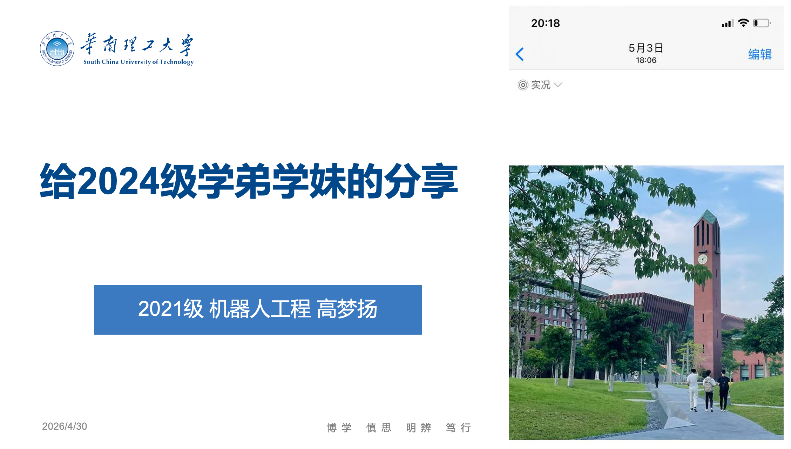

我常说自己在本科四年只读了四本书。

## 第一本书是南科手册

2022年初，我在寻求华工的课程信息时发现，除了官方“精品课程”，有用信息寥寥无几。然后我看到了[南科手册](https://sustech.online/)，一个聚焦南科大校园信息的公益开源项目。我意识到华工人也迫切需要这个，于是决定牵头实现。

考虑到我们这一代人习惯于移动互联网，我与同学一起，先创建了“GZIC 小圈” 公众号。基于国际校区最新成立，各种信息相对匮乏闭塞的事实，我们优先搜集华工国际的重要校园信息并分享。但微信公众号不是⻓久之计，移动互联网各巨头 APP 都在打造数字围墙花园。最终决定搭建网站“华工手册”，开始学习互联网前后端、数据库等相关知识，并与校园组织/自媒体平台合作，避免重复工作，促进信息流通和共享。还学习了知识产权知识，由此认识了我的偶像 Aaron Swartz 和信息分发理念 RSS。

关于华工手册的详细发展和迭代过程在此省略一千字，总之平台搭建起来了，在很多朋友的支持和帮助下，有了一个公众号"GZIC小圈"，有了一个华工人自己的信息聚合平台——[华工手册](https://www.gzic.online/)。

发起华工手册，一方面确实体会到华工信息闭塞的不便，自己有这个需求。另一方面，在南科手册的[关于⻚](https://sustech.online/about/)，我看到一行不起眼的文末小字——“一起完善这本手册!”。它在呼吁看到的同学（也许不只是学生）一起建设内容，使其更真实准确、与时俱进、减少偏见，从而更好地造福南科大的学生、教职工、行政、家属。

虽然我并非南科大的学生，但这句话确实对我产生了无比巨大的影响。**那是我第一次意识到世界上有些东西是由具体的人创造出来的。通过南科手册，我看到了同是20岁的大学生能为身边人、为所在的社区、为这个社会和世界做些什么。** 

南科手册是五年前南科大的学生做的——五年前的同龄人做的。他/她们能做出对南科大学生和教职工等有益的事情，华工人需要这个，华工人没有这个。为什么不能我来呢？

这也是我最想分享给各位学弟学妹的理念。乔布斯曾说，

> Once you discover one simple fact, and that is that everything around you that you call life was made up by people that were no smarter than you. And you can change it, you can influence it, you can build your own things that other people can use. Once you learn that, you’ll never be the same again.

倒是不喜欢比来比去，所谓“smarter”, "no smarter", 把其中一句话稍作修改，分享给华工的学弟学妹：

**“你身边被称为‘生活’的一切事物，都是由人造就的，我们也可以参与其中。”** 

## 第二本书是上海交通大学生存手册

> “国内绝大部分大学的本科教学，**不是濒临崩溃，而是早已崩溃。** “

虽然[书](https://survivesjtu.gitbook.io/survivesjtumanual/)成于2008年，但非常值得阅读，它值得我用简练的语言做最正式的推荐。

想借这本书分享给华工的学弟学妹：

**你想要的是什么？你想在大学本科四年，亦或研究生两三年，亦或博士生五年时光中做什么。之后呢？** 

以及最重要的：**思考之后，该是行动。** 

## 第三本书是机器人工程师学习计划

2022年初我在互联网上阅读到DJI杨硕前辈写的[这篇文章](https://zhuanlan.zhihu.com/p/22266788)，一点点读完，心中感慨——怎么这么详细，怎么这么认真。在这本书里我感受到参与机器人竞赛对提高机器人领域工科生的综合能力有极大益处，于是和一群同样热爱机器人技术的同学聚集在一起，在张东教授的支持下，在2022年年底于国际校区成立了RobotIC机器人实验室，参加Robocon机器人竞赛。

我在队里做过技术，也做过管理。如今 RobotIC 已经成立一年半了，我多次作为实验室代表，参与校内外各种机器人展示和交流。从零开始组建实验室的我们就好像在创办一个企业。中间也有曲折，但最终回过头来看，创办RobotIC机器人实验室并与它一起成长，是我本科期间最骄傲的事情。

想借这本书分享给华工的学弟学妹：

**找到自己热爱的事情，并真正投入进去。** 

大学平台很广阔，不要被所读专业和学生身份限制。大学里很多人和事，你或眼花缭乱，或有所想法，我建议多去探索和尝试，不要在没有了解的情况下过早做决定，而是在尝试过后基于自己实际情况（能力匹配、已知信息、付出、期望、兴趣爱好等等）认真地作出选择。

在接触新事物（专业方向、兴趣爱好、社团组织等各种你在大学打算探索的东西）的时候，也许你会想全都要，但我必须要提醒一下，**成为全才很难，要做抉择** 。**作出选择之后，请投入进去** 。尽可能在一个领域有所专长的同时尽可能对其他领域有一定了解。

整个过程应当是一个勇敢和严谨并重的过程，欢迎学弟学妹多与师长朋友、家人前辈等多交流，如果有什么你觉得是我能帮上忙的，也欢迎来找我聊聊。但最终做的决定，应当听从你的内心。

另外，**条条大路通罗马，打竞赛当然不是唯一的选择，每个找到自己感兴趣和认可的道路，并在其上持续付出努力的人都值得尊敬。** 

在此也打个广告，欢迎各位学弟学妹关注和申请加入华南理工大学机器人实验室，分别是五山校区的华南虎战队和国际校区的RobotIC战队！

## 第四本书是CS自学指南

这是一个北大信科学生本科四年的学习历程和推荐资料。点开它不一定非得冲着计算机科学，作者对教育和学习的观点值得一看。这本书的《后记》还有网友们在网站内的评论，有很多对于知识和教育的真诚思考与讨论。

在此呈现后记的[最后一段](https://csdiy.wiki/后记/)。

> 今天是2021年12月12日，我期待在不久的将来这个帖子会被遗忘，大家可以满心欢喜地选着自己培养方案上的课程，做着学校自行设计的各类编程实验，课堂没有签到也能济济一堂，学生踊跃地发言互动，大家的收获可以和努力成正比，那些曾经的遗憾和痛苦可以永远成为历史。我真的很期待那一天，真的真的真的很期待。
​
>PKUFlyingPig
​
> 2021年12月12日写于燕园

并借此分享给华工的学弟学妹：

**资源很丰富，尽快认清一切靠自己的事实，对自己负责。** 

华工很好，但并不是考上华工就前途一片光明。21世纪20年代的信息更新速度极快，很多传统模式很难跟上世界的变化。如果狭隘地认为一切信息和资源都来自一个平台，长期只接受固定的信息来源（例如微信公众号/贴吧/知乎/某个KOL等等），会被各种因素例如社区基调、推荐算法等潜移默化影响，极大阻碍个人发展。

再说一次，不要限制在某个单一的媒介或者平台。很多东西是可以通过互联网、前人经验、实践等方式获取的。

之前在学习Web和UWP相关知识时看到一句话让我印象深刻。

> 最后说下我个人生活里的 App。App 在我的世界里的存在感极低，当然我本来用手机的时间就很少。我给无数人做过手机上的各种玩意，但我本人对智能手机还是半无视的状态，我甚至不记得我的 iPhone 是第几代。知乎 App 在我这只有一个用法，那就是扫描 Web 二维码在电脑上登录。后来我发现有别的登录方法，就把知乎 App 删了。如果你对这种生活方式感兴趣，不妨一试。**当你拒绝手机刷知乎之后，或许会看到更大的世界。** 
> 
> 作者：SimbaCho
> 
> 链接：[https://www.zhihu.com/question/321289269/answer/3168878026](https://www.zhihu.com/question/321289269/answer/3168878026)

这个领域可以往信息素养方向拓展，如果你感兴趣，可以尝试了解这些关键词：GitHub、开源Open Source、开放获取Open Access、Web（不是互联网而是万维网）、推荐算法、找到志同道合的人——社区和论坛（而不**只** 是群聊）、与人保持正式的联系——邮件（而不**只** 是微信），以及（以**公开课** 、课程官方**网站** 为例的）优质教育资源和模式。

扯远了，资源很丰富，那么你要做的就是用起来了。大学四年时光很宝贵。时间对每个人都是公平的，多少步入社会的人在吐槽自己的社畜生活，随着年龄的增长，各种事情不得不被考虑。多多珍惜校园时光，很多空出来的时间由你自己支配，你想把这些时光花在什么地方？

一切都有可能，自己对自己负责就好。

## 如何使用这四本书

**独立思考，辩证看待。** 

任何人的观点都不应该被无条件接收（包括这句话）。刚刚成年经历高考的你们可能还不能理解这八个字的意味。很多成年人也要在走向社会的一次次犯错中才意识到不能一切都随波逐流，照搬照抄。信息时代，请努力保留自己独立思考的能力。我们会遇到很多论述和判断。但事实/真理/观点/描述的区别，这些都因人因时因事而不同。

拿交大生存手册来说，写于2008年的文字，有多少适合那时候的上交，有多少适合现在的上交，又有多少适合现在的华工或者任意一所大学？再者其主要编写人员多是理工科（尤其计算机）背景，其所在意、钻研、赖以生存的事物不一定与你一致。因此这本册子的内容值得一读，但不应盲目崇拜，动辄“你读过交大生存手册否？”亦是一种悲哀。

再以机器人工程师学习计划和CS自学指南举例，很多人在初学时容易因为接触太多细枝末节的知识，还没打好基础就过早陷在具体细分方向，因而错过了更广袤的世界，这是一种遗憾。这两篇文章希望能尽量辅助初学者建立起对机器人、计算机等领域的知识体系认知。各种学科指南（例如[浙江大学课程攻略共享计划](https://qsctech.github.io/zju-icicles/)）作用都是类似的。

随着时代发展，科学技术和教育资源会越来越新，因此不要奉任何一篇文章为神，而应抱着发展的眼光拥抱变化。至于如何学习具体一门学科，我相信你肯定能找到。

**如何找到自己真正热爱？如何抉择？** 

注：下面一段话可能有点不温柔。

你的热爱，尤其是一个刚经历过高考的准大学生的热爱，通常是没什么独到性的。不是说不好，而是说可能你目前了解“兴趣、爱好、人生未来”的渠道，是不够真实和具体的。你可能接触很多宏大叙事、很多二手信息、很多人云亦云所以你也云的东西。

但真正的爱好不是泛泛而谈，它一定建立在你对该领域有一定认知基础上，你才能说自己有可能在某个领域生根发芽。就好像假设你喜欢打篮球，你喜欢这项运动绝不是因为看到球在地上会反弹两下就说嘿我这辈子一定要在篮球上做出点名堂，打个耐高冠军啥的。不是的，你一定是因为对这项运动有所了解，知道人们为什么要分队，为什么要有一些运动规则，如何拿分，这些才构成这个竞技体育，才是篮球的魅力。也正是这些，才能支撑你在这个领域的探索和发展。

换个领域也一样，不管你喜欢的是足球、羽毛球、瑜伽、长跑、骑行等运动，还是机器人、航空航天、计算机、医学、文学、金融等学科、再或者是创业、科研、或者各种人生规划，都没关系，都挺好，但我希望你是在有一定了解后作出的选择。

以我所在的机器人领域为例，如果你说你喜欢机器人并且认为自己是干这块的料，请你自行思考一下，究竟是因为科幻片中那些炫酷的长得像人的机器人而心动，还是认真了解过相关领域（Perception, Locomotion, Manipulation, Planning, Control and Dynamics, etc.)的高质量信息后有思考与实践？这几年“人形机器人”“具身智能”如此火热，仿佛明天就能看到人类科幻般的未来，你下定决心想加入其中摸一把。请你分析一下这是资本热，政策热还是技术突破了？窃以为目前核心技术突破只有大模型在感知、规划和交互上带来的应用突破，而不是机器人核心的控制与机器人学相关领域有所突破。各种媒体吹捧的模仿学习、VLN，其实也不是这两年才开始提。（by the way, 在Embodied AI 这个领域，我会很关注以Google 的[RT-2](https://robotics-transformer2.github.io/)为代表的数据模式，以及一位华人学者 [Cheng Chi](https://cheng-chi.github.io/) 提出的Diffusion Policy。有机会再聊吧，通用智能机器人的未来是我辈许多人工智能机器人工程师的最终理想，但其商业落地的过程会很曲折残酷）

我鼓励大家追梦，只是希望能脚踏实地——“脚踏实地的理想主义”。

吸收那么多信息和资源，其实关于如何使用这四本书，就一句话：

**审慎思考，结合自己的实际情况，开始行动。** 

## 结语——关于生活

> “很多时候人的焦虑来自于看别人怎么怎么样，自己一定要去和其他人对比。比如我们做机器人这个领域，和AI和CS领域的研究人员比发论文的数量肯定是比不过的。同样是做机器人，自己从头开始去搭一套机器人系统，和加入一个已经有很多年积累的大组比如ETH的Marco Hutter组，花的功夫肯定也是不一样的。最重要的排除掉这些与别人对比的心态，只关注自己的提升和成长，每日有进步就好，扎实地积累，总会有结果的。万物生长，各自高贵。
> 
> 再者，大家看到一些很厉害的人做出很了不起的成就的时候，应该这样想：能和你生活在同一个时代是我的荣幸，我必将以你为榜样努力，争取有一天能够在自己的专业领域做出能和你比肩的成绩；就算我做不到，我依然是这个因你而更加伟大的时代的一名见证者。我在读博士之前就很仰慕Frank Dellaert和Marco Hutter的工作，读博士以后用了两三年时间得到和他们讨论、合作科研问题的机会，这个过程本身其实就挺美妙的。“
> 
> [YY硕：博士第三年](https://zhuanlan.zhihu.com/p/357353090)

以后你们会遇到很多人为的比较，甚至是对立、攻击和诋毁污蔑。不要太过在意别人的观点，把自己的生活过好就很棒了。

如果从外界获得了些不积极的反馈，没关系，我们换个角度：别人批评你要不是你某个地方做得略有不足，或者你们是竞争对手。前者是好事，代表着有成长空间啊，后者是因为你的变好阻碍了其发展空间，都是有原因的。所以不必被负面评价影响到。

我机器人队的导师常说，“我不是你们的老师，其他队伍的参赛选手才是你们最好的老师。他们研究你们的技术，分析你们的战术，甚至可能比你们自己还清楚你们的弱点在哪里。” 这样的批评和竞争，我求之不得。至于那些PUA，污蔑和泼脏水，你花一秒钟去理会都是在浪费时间。

另外，这个世界不存在谁是神。在某个领域做得好唯一原因是ta把时间和精力花于其上。因为到了一定程度，大家都优秀，都努力，都积极。只有时间和精力可能分配不同。

为什么高考录取分数差不多的同学经过大学四年培养毕业后的情况相差那么大？以华工为例，能考上这里，大家至少都有一定的学习能力和基础（在传统评价标准尤其广东境内，华工也勉强算是一个好大学了）。但是为什么四年后人与人不同？普遍意义上会被关注的出路、薪资、绩点等等，为什么会有区别？

我的理解是每个人的选择不同。时间对每个人都是公平的，一天就24小时，有的人把主要时间和精力花在课业内，有的人花在科研上，有的人选择真正走到社会实际需求里去，有的人……不同的人因为不同的原因，选择了不同的事情，没有关系，本质上也没有区别，都是在生活，只是选择的方向不一样而已。

因此我从不因谁绩点高就高看谁，或因绩点低就低看谁。我只钦佩那些经过慎重考虑后选择目标并坚定执行的人。（把“绩点”换成任何一个可量化的标准都行）

---

大学期间组建过国际校区第一支校园乐队，组织过三下乡去做农村经济调查，参加十大提案给学校贡献过几个提案。想和大家分享的还有很多很多，包括信息素养（RSS、个性化算法），开源理念、我的偶像Aaron Swartz。受限于篇幅，便也不展开了。

分享的四本书顺序是我的真实接触时间顺序，对我意义最重要的也正是第一本，南科手册。它启蒙我——**这个世界可以更美好，我们可以参与建设它。** 

高三时很喜欢的一句话，在此也分享给大家：

> 世界上只有一种真正的英雄主义，就是认清了生活的真相后还依然热爱它。

感谢各位学弟学妹耐心阅读这篇分享，文中或有疏漏，但字字句句皆是我大学时光的真挚感悟。惟愿只言片语能对大家有所帮助。

参考资料：

1. [南科手册](https://sustech.online/)
2. [上海交通大学生存手册](https://survivesjtu.gitbook.io/survivesjtumanual/)
3. [机器人工程师学习计划](https://zhuanlan.zhihu.com/p/22266788)
4. [CS自学指南](https://csdiy.wiki/)

初稿写于2024年7月。

最新于2025年8月修改，考虑补充面向升学和就业的内容。
