## 概述

> 很多没接触过3D打印的小白会以为3D打印是复杂的事情,是不是要3D建模啊?或者有复杂的参数设置等等,**其实现在的3D打印已经做的非常简单了** ,不会3D建模也没关系,很多3D模型都是可以去网站免费下载直接使用的,等你玩的时间久了,想玩的更深入了可以再学习3D建模. 包括后面的切片软件设置厂家都内置好参数了,**简单的点几下设置就能打印出3D模型。** 
> 
> [新手3D打印指南-拓竹P1P封箱 - 少数派 (sspai.com)](https://sspai.com/post/78835)

3D 打印是一门大学问，但如果短期内只是想学会用，你不一定需要了解很多知识，[拓竹 X1C](https://bambulab.cn/zh-cn/x1) 这款设备非常友善（也非常贵），把很多操作都自动化打包好了，因此用这台机器进行3D 打印非常简单，跟着这篇操作指南一步步往下做就行。
看完之后，你如果对3D 打印这种“创造的艺术“很感兴趣的话，建议去自行查阅更多信息，也多看看拓竹官网 [Wiki](https://wiki.bambulab.com/zh/x1/manual/intro-x1)，里面介绍了一些3D 打印机的原理。

## 操作指南

- 在建模软件（如 SolidWorks ）中把要打印的零件模型转换成 .3mf 或 .stl 格式文件。

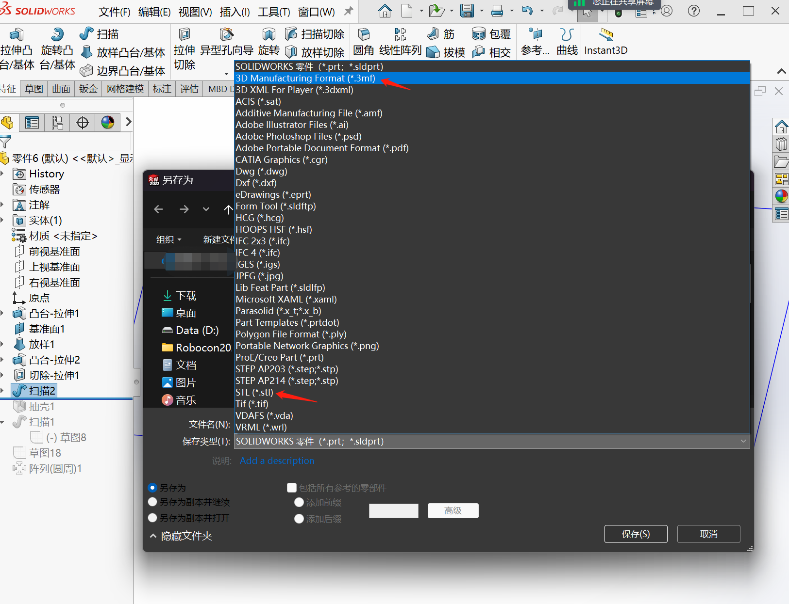

- 下载拓竹[切片软件](https://bambulab.com/zh/download)，打开并导入前面的 .3mf 或 .stl 格式文件。

第一次打开软件可能会要求选择型号和喷嘴，全默认即可。本文机型是 X1carbon。

导入之后页面右下角可能会出现各种说明，请根据说明进行调整。

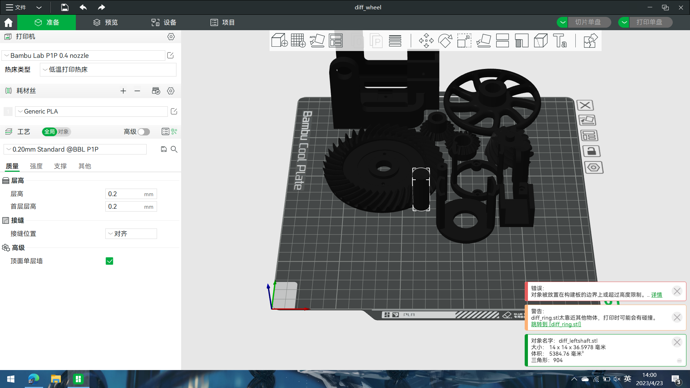

- 点击右上角第二个功能“切片单盘”，软件对文件进行切片处理。

有时切片失败，是因为有些打印件有很大的悬垂面，软件会提示**需要生成支撑** ，如果出现提示，在下图左侧的位置点击“开启支撑”。

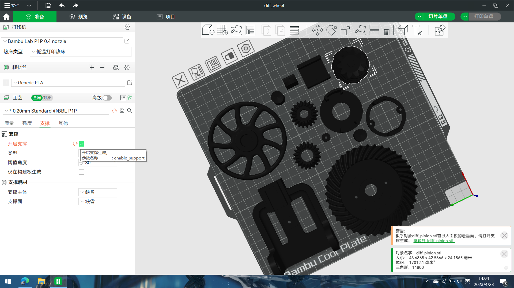

开启支撑后再次点击“切片单盘”，如图为切片完的效果。

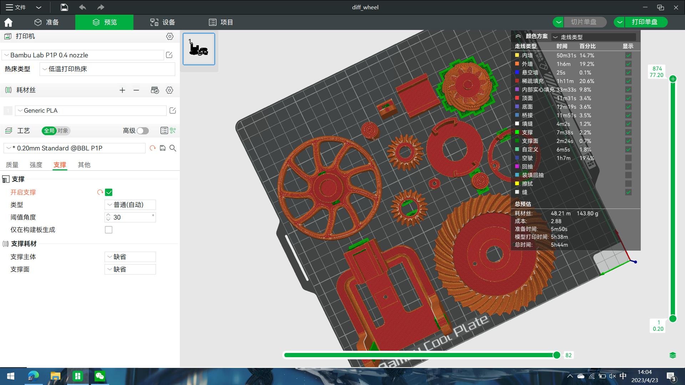

4. 点击右上角“导出单盘切片文件”，会生成一个新的 .3mf 格式文件。

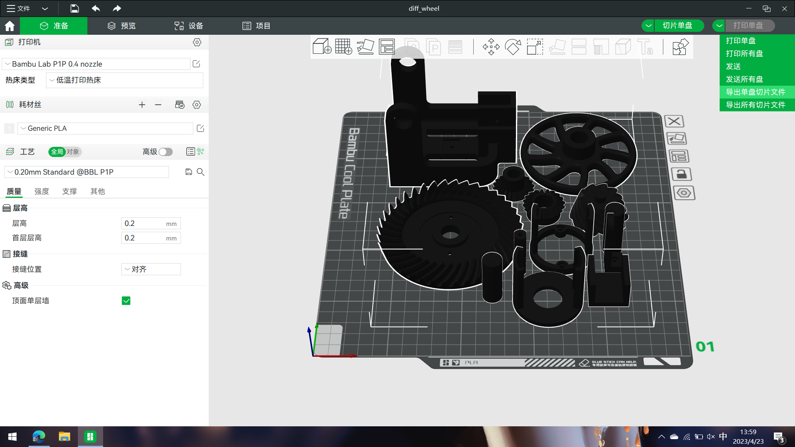

这个文件名称中可能会带有 gcode 字样，gcode 是一种数控（numerical control）编程语言，可供3D 打印机读取喷头移动路径、挤出量、运动速度等操作信息。

到目前为止，**我们从一个模型文件（如 SolidWorks 中的 .SLDPRT）另存为成了3D 打印切片软件通用的 .3mf 或 .stl 格式，再通过切片软件转换成供3D 打印机执行的 gcode 代码文件。** 

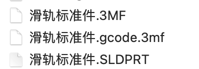

5. 把gcode文件导入 SD/TF 卡，再放入打印机。

6. 给打印机的打印面板涂固体胶，送入机架内。（此步可省略，是为了增强首层打印的粘性提高打印成功率）

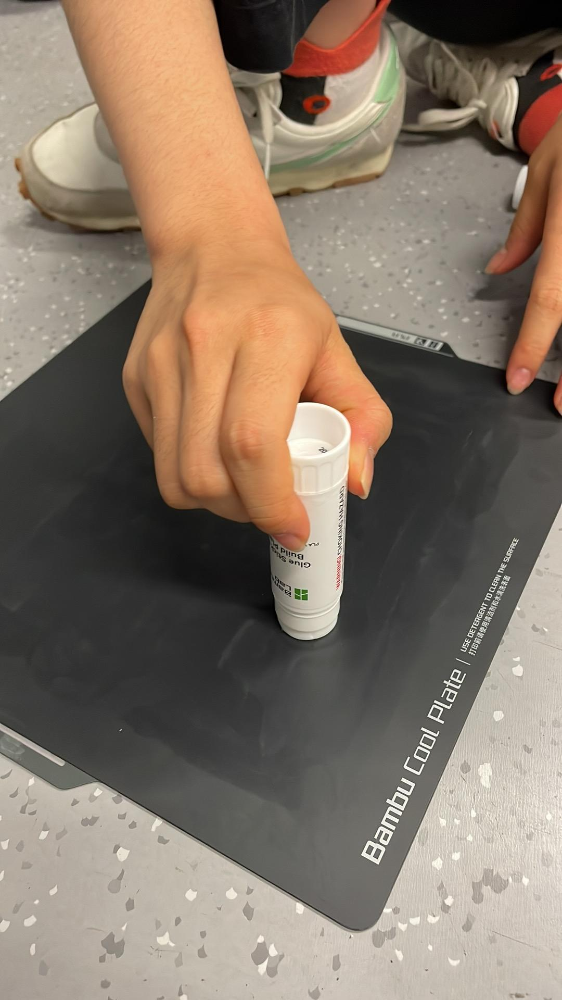

打印表面和热床是靠磁吸固定，因此最好是抬着放到位再落下，不要贴上后顶着磁吸力硬推进去。注意放的朝向，有 PLA 字样的靠外侧，各边对齐，不然之后可能会出现"Z 轴回零失败"等问题。

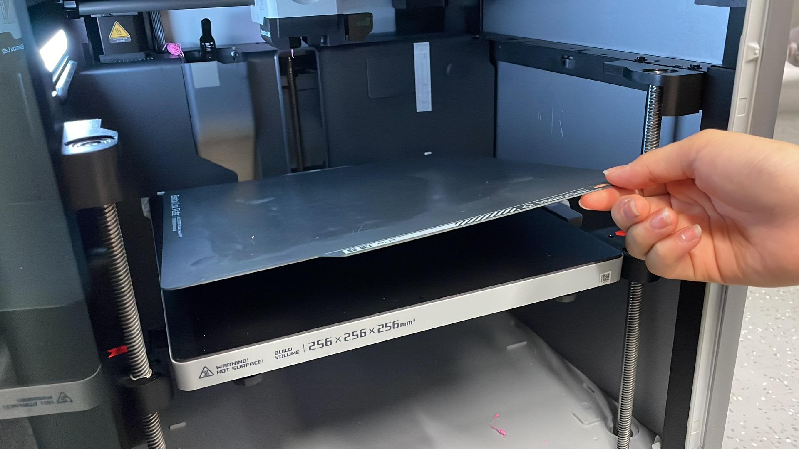

7. 点击最左侧的第三个按钮，选择你想打印的文件，开始打印。

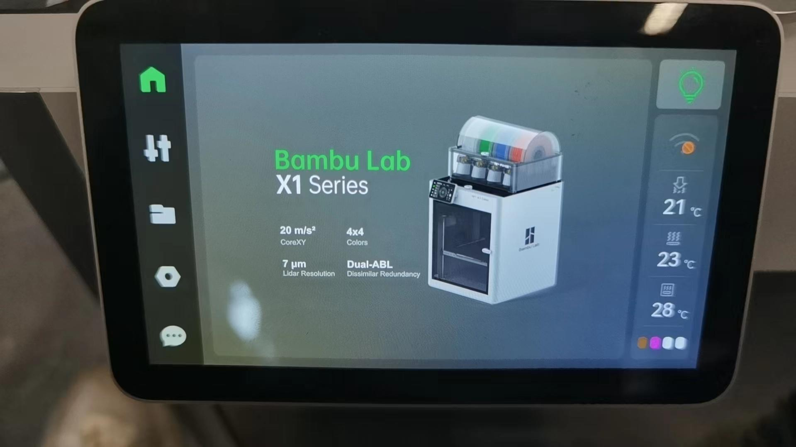

8. 打印完，待冷却以后拆下打印件。

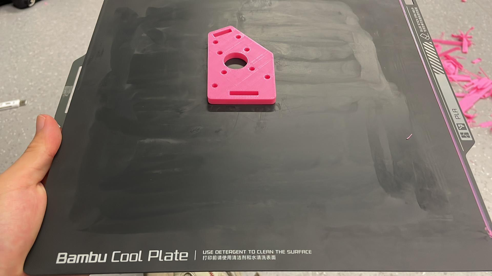

记得拆除打印表面边缘的测试线。如有需要请用水清洗打印表面以清除旧的固体胶残留。

## 常见故障

如果打印失败，可能是由很多问题引起的。实验室半年以来遇到的常见问题和解决方法如下：

触控屏失灵——去背后重新启动电源。

电机过载、插槽过载——可能是因为外围缠绕的料线被下面的线压住卡住了，重新缠一下。

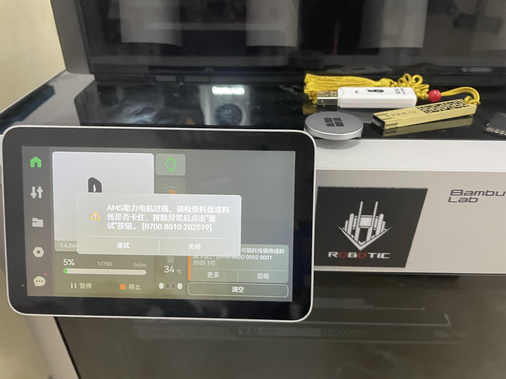

炒面——调慢打印速度、修改温度等方法可以都试试。

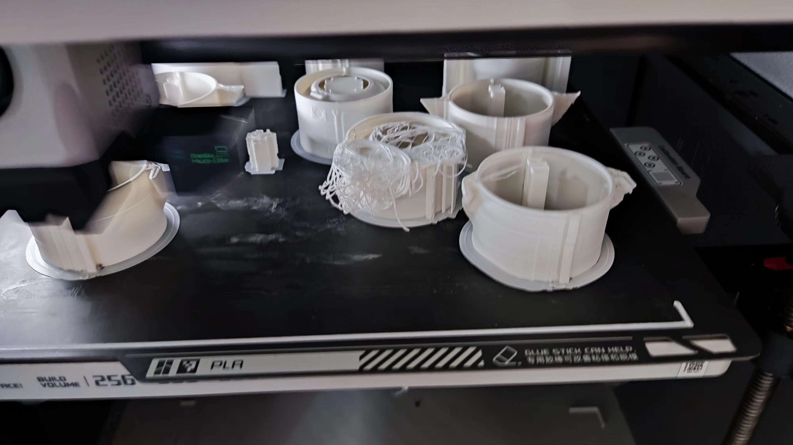

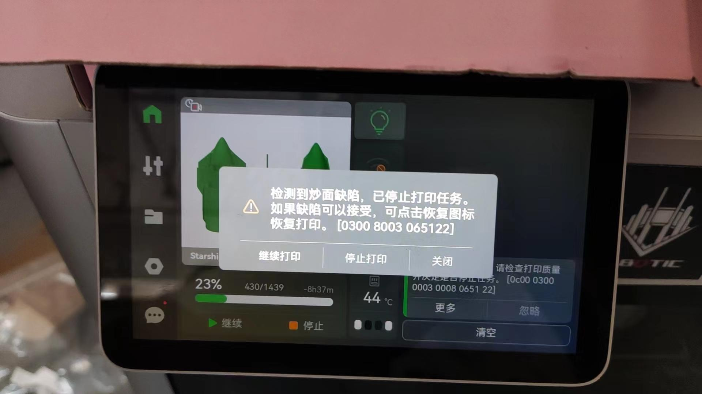

首层检测发现缺陷，打印失败——点击左侧第二个按钮。

然后点击左侧第二列的第二个按钮，设置热床温度到60°C，也许有用。

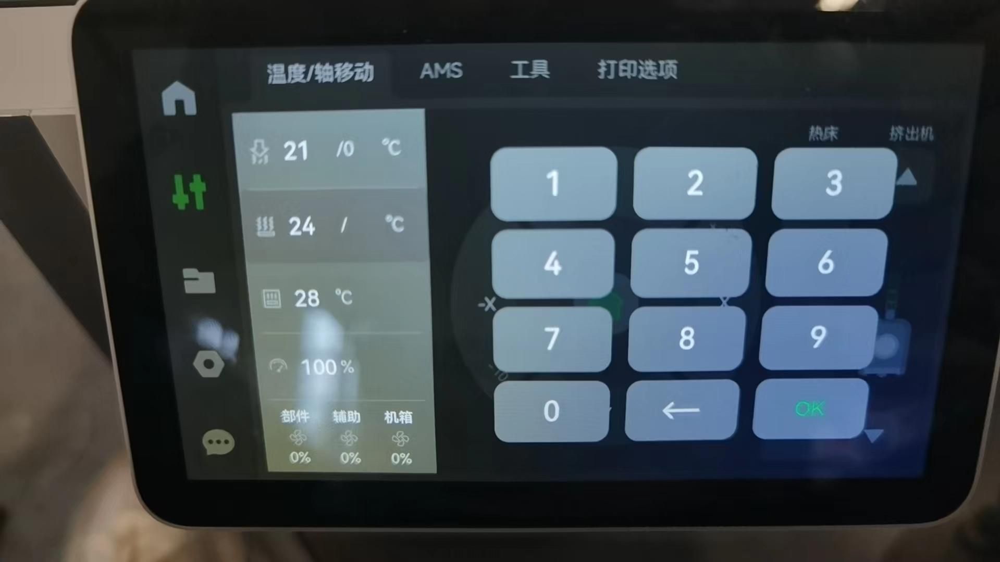

料线从工具头退回 AMS 失败——可能是料线断在料管里了（料的质量问题或者受潮），需要拆了AMS重新装，这个有机会慢慢讲。可以看看[机器维护 | 如何更换 AMS 内置 PTFE 管（特氟龙管）_哔哩哔哩_bilibili](https://www.bilibili.com/video/BV1Ue4y197ry)

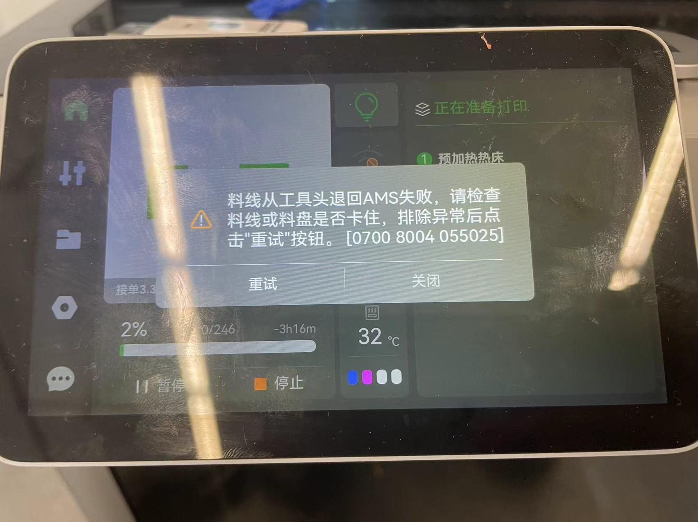

有时会找不到**导出切片单盘** 生成的.3mf 格式文件。这是因为当一次性打印多个文件把它们在切片软件中放到一起后，打印机读取到的文件其文件名称可能回溯到建模软件（如SolidWorks）中的某一个零件名称。

其他故障可参考官方 Wiki [故障排除](https://wiki.bambulab.com/zh/x1/troubleshooting)自行解决，或者联系实验室3D 打印机维护者（咱实验室机械组的基本都要会操作哦！）

## 注意事项

1. 打印机工作时温度较高（热端200度以上），打印完成后热端热床需要一定时间冷却。尽量避免把手放进去。
2. 3D 打印耗材（PLA 材料）容易受潮，如果已拆封的耗材建议放在 AMS 里，有条件的可以放防尘防潮箱。
3. 拓竹 X1c 不需要手动调平，对新手非常友好。

## 参考资料

切片软件操作指南 [https://wiki.bambulab.com/zh/x1/manual/introduction-to-bambu-studio](https://wiki.bambulab.com/zh/x1/manual/introduction-to-bambu-studio)
拓竹切片软件安装包 [https://bambulab.com/zh/download](https://bambulab.com/zh/download)

3D 打印模型分享网站：
[https://www.thingiverse.com](https://www.thingiverse.com/)
[https://cults3d.com](https://cults3d.com/)
[https://fl.himi3d.cn](https://fl.himi3d.cn/)

RobotIC 机器人实验室 高梦扬
2023年7月19日
