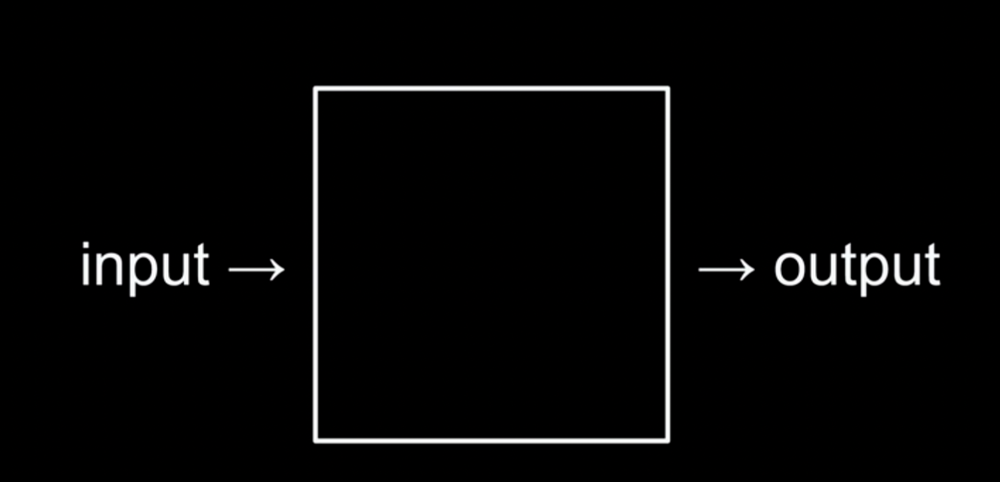
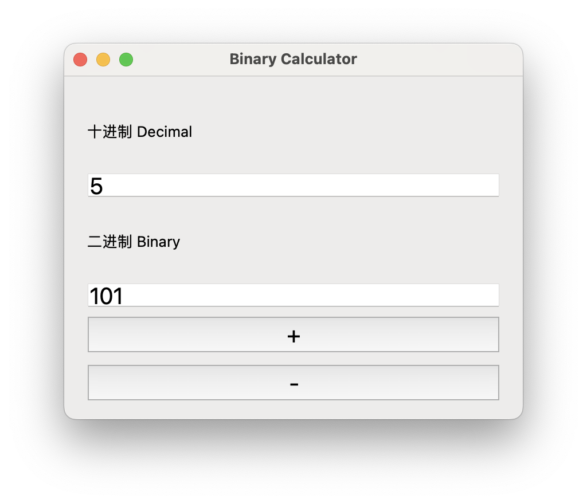
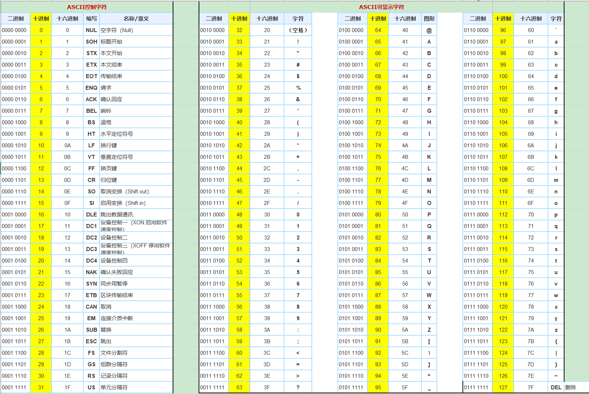
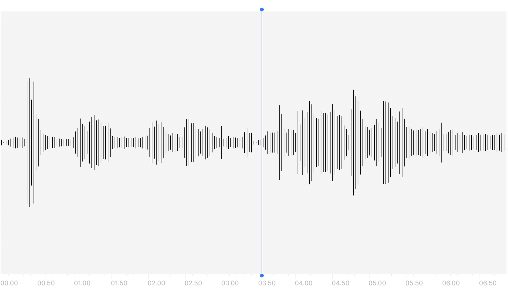
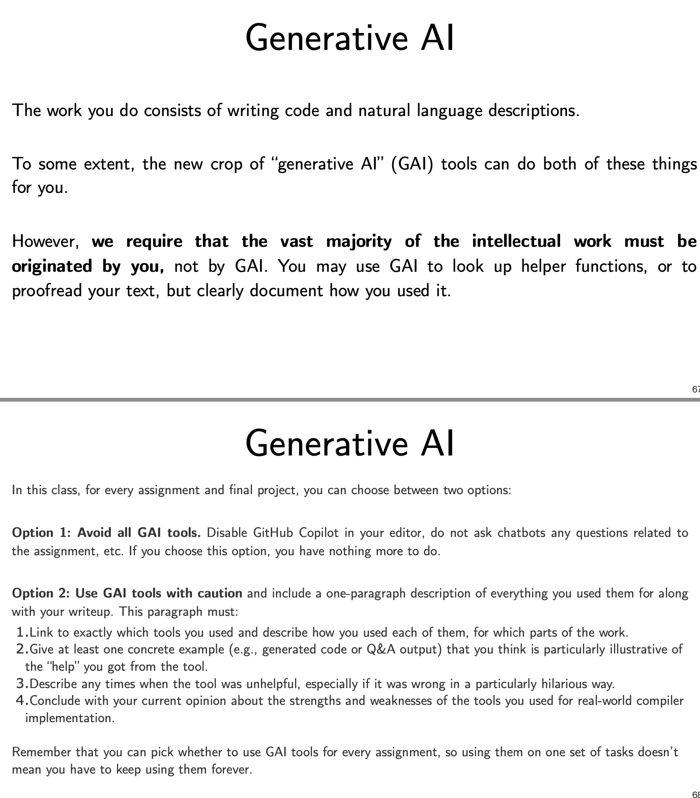

前言

2024年做过一次分享，主题是计算机科学纵览，现将大纲稍作完善成一篇讲稿，供需要的朋友参考。

本文可作为大学生/成年人学习计算机科学的第一节课，也可以作为初高中生计算机科学的启蒙。内容简化，多点图片互动，面向小学生也是可以的。有些用”[ ]”括起来的内容表示思路和引导，不能用来直接呈现。

当时分享大约两个小时，在介绍完图像视频音频后安排了中场休息，讲算法时有邀请听众上台互动。全程还伴随着一些即兴分享和聊天互动。根据主讲者的演讲风格、节奏和内容丰富度、取舍不同，大致可以在半小时-两小时的时长。

机器人方向出身的我不一定有计算机科班出身的朋友们认知精准和深刻，各位海涵哈。

## 开场

计算机是我们生活中无法或缺的一部分，有些人觉得它就是一堆复杂的代码，有些人将它与黑客电影中不断刷新的黑色屏幕绿色字母划等号，或许你还听到过前后端游戏开发，内核架构浮点数这些词。

这些都仅仅是计算机科学诸多面貌中的一部分，它远比我们日常所见更为深刻和广泛。

**计算机的本质, 深植于数学和信息论的土壤之中。** 

其核心是对信息的研究：如何将纷繁复杂的信息世界转化为可计算、可处理的数据形态？如何通过一系列精确而高效的算法/方法来解决问题。

The study of information. How do you represent it and process it.

可以说，所有的程序都只是在处理信息，从输入到输出，解决不同的问题。



## 进制和编码

## 进制

也许你已经听过，计算机里面全是010101.

在计算机的底层逻辑中，二进制扮演了基石的角色。逢2进1的规则简单而高效，使得0和1成为了构建整个数字世界的砖石。为了直观展现这一点，我们接下来可以参考一个程序，它能让我们亲手操作并理解二进制数的转换过程。

[通过一个Python写的程序 binary_calculator.py 来呈现，程序源码如下，需要安装PyQt5包，  `pip install pyqt5`]

```text
from PyQt5.QtWidgets import QApplication, QWidget, QVBoxLayout, QPushButton, QLineEdit, QLabel
from PyQt5.QtCore import Qt
from PyQt5.QtGui import QPixmap, QPalette, QBrush

class BinaryCalculator(QWidget):
    def __init__(self):
        super().__init__()
        self.initUI()

    def initUI(self):
        self.decimal_label = QLabel('十进制 Decimal')
        self.decimal_input = QLineEdit()
        self.decimal_input.setStyleSheet("font-size: 20px")
        self.decimal_input.textChanged.connect(self.decimal_to_binary)
        self.binary_label = QLabel('二进制 Binary')
        self.binary_input = QLineEdit()
        self.binary_input.setStyleSheet("font-size: 20px")
        self.binary_input.textChanged.connect(self.binary_to_decimal)

        self.add_btn = QPushButton('+')
        self.add_btn.setStyleSheet("font-size: 20px")
        self.add_btn.clicked.connect(self.add)
        self.sub_btn = QPushButton('-')
        self.sub_btn.setStyleSheet("font-size: 20px")
        self.sub_btn.clicked.connect(self.subtract)

        vbox = QVBoxLayout()
        vbox.addWidget(self.decimal_label)
        vbox.addWidget(self.decimal_input)
        vbox.addWidget(self.binary_label)
        vbox.addWidget(self.binary_input)
        vbox.addWidget(self.add_btn)
        vbox.addWidget(self.sub_btn)

        self.setLayout(vbox)

        self.setMinimumSize(400, 300)    # set window size
        self.setWindowTitle('Binary Calculator')

        # code for setting background image
        pixmap = QPixmap("your_image_path_here.jpg")
        palette = QPalette()
        palette.setBrush(QPalette.ColorRole.Window, QBrush(pixmap))
        self.setPalette(palette)

    def decimal_to_binary(self):
        try:
            decimal = int(self.decimal_input.text())
            self.binary_input.setText(bin(decimal)[2:])
        except ValueError:
            pass

    def binary_to_decimal(self):
        try:
            binary = self.binary_input.text()
            self.decimal_input.setText(str(int(binary, 2)))
        except ValueError:
            pass

    def add(self):
        decimal = int(self.decimal_input.text()) 
        self.decimal_input.setText(str(decimal + 1))

    def subtract(self):
        decimal = int(self.decimal_input.text())
        self.decimal_input.setText(str(decimal - 1))

if __name__ == '__main__':
    app = QApplication([])
    ex = BinaryCalculator()
    ex.show()
    app.exec()
```



## 编码

计算机是很笨的, 它们只能读懂0和1 , 不懂汉字的“你我它” , 实际上也不懂英文的“abc”. 那它是怎么存储咱看到的中文、英文、以及其他语言呢？

做一个映射！让不同的字母字符匹配一个我们规定好的010101串。

有一群人发明了一个叫做 ASCII (American Standard Code for Information Interchange)的东西，给字母、数字及特殊符号分配了独一无二的二进制数值。



例如数字5，简单的二进制表示是101，在ASCII表中是00110101，这就是统一的唯一标识。

这样做的好处是什么?** 让计算机系统通过有限的二进制数表示无限的信息** 。

我们试一下，如何用二进制表达一个句子”Hi!”，那就是找到”H””i””!”三个字符的唯一标识。01001000 01101001 00100001

ASCII, 是目前世界上最通用的信息交换基本标准，它于1967年发布，最后一次更新于1986年。

回看那张图的右下角，ASCII最大的有效位也就7位，没有更多的空间存其他字母、数字、特殊符号。

那中文怎么办?日文、韩文、其他国家的文字, 颜文字, 表情怎么办?

随着全球化和技术进步带来的需求, 在ASCII的基础上，又有一群人发明了Unicode(万国码、统一码), 旨在解决全球范围内所有语言文字以及表情符号的统一编码问题, 尽可能确保全球范围内的信息流通。如果你见过utf-8之类的字样，那就是遵循Unicode的案例。

附加环节:

一个表情emoji, 有不同的肤色, 怎么办?


[先问, 启发大家思考，然后引出下文]

当然可以给不同肤色的表情专门设置一个编码，但实际上现代编码体系采用了更智能的设计策略，用基本emoji图案结合附加属性（例如肤色），来灵活地表达各种变化形态。

- **基本emoji图案** : 是不带任何附加属性的基础表情符号。
- **附加属性** : 例如肤色。

在Unicode中，表情符号和附加属性（如肤色）是通过组合多个码点来实现的。

一个基本的笑脸表情符号可以与一个肤色**修饰符** 组合在一起，形成一个带有特定肤色的笑脸表情符号。

[这方面可以往修饰符、对象和属性等话题延展开来]

## 信息的模态——文字、图片、视频、音频

现代生活中，信息的表现形式已经远不止于文字，更多的是通过图片、视频和音频来表达。

这些又是怎么存在电脑里的？

## 图片

图片的本质是什么? 是数字。

[放大一张图片，这里放上我最喜欢的宵宫]


可以看到第一张图里很清晰，第二张图里就很粗糙了。甚至可以看到一些正方形格子，那些叫**像素** 。

一张图片由很多很多的像素构成。

在8位（bit）彩色图像系统中，每一个像素都由RGB三通道组成，分别表示红色、绿色和蓝色的亮度，数值范围为0-255。

[为什么是0-255？可以回顾二进制十进制转换，看看十进制255是不是对应8位]

现代的颜色显示系统大多采用这个RGB模型。每个像素都有红、绿、蓝三个通道的颜色强度值，各自从0到255。因此一个像素就可以表示出 256 * 256 * 256 = 16,777,216 种不同的颜色，基本可以覆盖人眼可以分辨的所有颜色。

## 视频

进一步看视频, 它的本质依然是数字。

一个视频由很多很多的图片构成. 一个视频可以视为由连续帧的静止图片快速切换而成，这里的帧率或刷新率（FPS, Frame Per Second）决定了画面流畅度。每一帧都是一个独立的图像，随着时间轴的推进而形成动态影像。

[放映一个视频举例，通过键盘或者别的方式切换帧，感受多张图片构成]

[找翻页动画的素材，例如[https://www.bilibili.com/video/BV1kG4y1d7wQ/](https://www.bilibili.com/video/BV1kG4y1d7wQ/)]

## 音频

音频的同样是数字。

我们的声音是由肺部、声带和喉部等部位协同工作产生的。那么，这些声音是怎么存到电脑里的呢？声音信号是模拟信号，它要被转化为计算机可以理解和处理的数字信号（也就是前面我们大家已经了解过的各种0和1）。

这个转化过程叫做**采样** 。就像在音频信号上设置一系列的数据点，这些数据点的值和位置（代表时间）构成了我们的数字信号。

然后我们再进行**量化** 。使得声音波形和音位振荡的幅度的连续变化也化为离散数值。最后，通过编码将量化后的离散数值转换为二进制形式，以便计算机存储和处理数据。



音频/声音/语音的处理，会涉及到很多信号处理的知识，各种变化、滤波，为的是得到想要的信号。本质还是数学的东西。

声音领域的应用很丰富，采样率和量化精度直接影响着音频质量，也就是我们常说的音质。大家听歌软件上是不是有个音质选项？什么标准、极高、无损之类的。以无损音质为例，通常提供192kb/s或更高的比特率，这代表它采样和量化的分辨率很高，保留了很多细节。

还有很多应用，例如数字人的搭建也需要STT（Speech-To-Text）、TTS（Text-To-Speech）。语音交互是一种直观自然、互动效果好的交互方式。

## 文件格式、文件压缩、密码学

想想视频, 一个视频里一秒有那么多张图片, 一张图片里有那么多的像素, 那一个视频该有多大呀!

为了解决文件过大的问题, 一些人折腾出了文件压缩技术. 一个文件的大小由多个因素决定，包括数据的密度、文件的熵（或混乱度）等。文件压缩技术主要通过减少这些因素来减小文件的大小。通常有两种压缩方法：有损压缩和无损压缩。有损压缩将丢弃不太可能被注意到的信息，如图片文件格式例如JPEG，音频文件格式MP3；无损压缩则尽量保存原始信息，如ZIP和RAR文件打包压缩。

视频文件格式如MP4、MOV，3D文件格式如3MF、OBJ、FBX等，均采用了先进的压缩算法来减少存储空间占用。

另一方面，我们还常常需要对信息进行安全传输，这就涉及到了密码学。加密就是将原始数据（明文）转换为不能直接理解的密文，目的是为了防止未经授权的访问。解密则是加密的逆过程，将密文还原为明文。这一块不是我的专业方向，就不在这瞎说了哈。

加密和解密技术保证了信息的安全传输，利用复杂的密码学原理对数据进行编码，只有拥有正确密钥的人才能解码获取原始信息。

举个例子，大家访问浏览器时（可别告诉我现在你们都只会用APP，不知道什么是浏览器）顶部的URL地址栏会看到 "https://"之类的东东，那个HTTPS就是一种安全访问协议，以前是用HTTP的，别人能看到你访问哪个网站，在里面做什么，因为网络流量被明文传输。现在普遍采用的是HTTPS，会好很多。

[文件格式、压缩、密码学这些话题可以往压缩算法、加密算法、计算机网络、网络安全、互联网等领域展开]

## 存储

刚刚说了那么久的数据和数字, 那么这些东西保存在哪里呢? 保存在内存里(working memory)

在计算机中, 存储起着核心的作用。简单来说，内存是计算机中用于临时存储数据的硬件设备.

在计算机中，内存主要分为RAM（随机存取存储器）和ROM（只读存储器），RAM是暂时存储计算机运行时的数据和程序，因此越大的RAM意味着我们的计算机可以同时运行更多的程序。ROM一般用于存储固定不变的信息，如系统的启动程序。

以刚刚的图像为例, RGB的三个数值是怎么存储的呢？通常情况下，图像在电脑系统中被存储为二进制文件，每个像素可以用一个24bit的数据来存储其颜色信息，其中，红、绿、蓝三个通道各占8bit。

此外，还有一种包含透明度信息的像素表示方法是RGBA，增加了一个alpha通道表示透明度，也是8bit，所以一个像素就会占据32bit的空间。

内存的原理和数据结构有很大的关联。例如，当我们要存储一个数组时，数组的元素会被连续存储在内存中。因此，我们可以通过计算偏移量来快速访问数组的任一元素。这就是内存寻址的基础原理。

当然具体如何读取数据，还有分配内存空间之类好多操作，就比较复杂，涉及到很多计算机底层的东西，今天就不展开啦。

## 算法和开发

有了那么多的数据，我们要怎么用起来呢? 这就涉及到了各种算法.

还记得最开头说的解决问题吗? 中间那个框, 大家就可以理解成算法/程序/解决方案, 算法是解决问题的一种方法或者步骤，它定义了数据处理的具体操作过程。

算法非常重要, 诸如Google/Bing/百度搜索引擎用的排序算法、Facebook/B站抖音快手等视频软件用的推荐算法、自动驾驶汽车用的的最短路径算法，网络通信的寻址路由, 都是我们生活中常见的算法应用。

[字典查字举例]

Linear Search, Binary Search

Selection Sort, Bubble Sort

[邀请观众上台，互动，一人一个拿着1～7的号码，乱序/排序，在七个号码中找到想要的号码]

以上就是一些基本的搜索和排序算法啦，是不是很好理解？

评价算法性能优劣的指标除了是否完成任务之外，有两个通用指标：时间复杂度和空间复杂度。

时间复杂度描述了算法运行时间随输入规模增长的增长关系；而空间复杂度描述了算法运行过程中所需存储空间的增长关系。例如，线性搜索算法的时间复杂度就是O(n)，这意味着它的运行时间将随输入规模线性增长。

除了算法，要用好前面的数据（信息）还有一个很重要的点，**如何与信息交互** 。

因此我们会有浏览器和网站网页，会有Windows、macOS、Linux， iOS和安卓等操作系统，以及各种软件（或称客户端、APP、应用）。

这就涉及到很多知识了，前后端、客户端、引擎和框架、版本管理和协作开发等等……


左上[原神官网](https://ys.mihoyo.com/main/)，左下[原神B站官方帐号](https://space.bilibili.com/401742377)，右上[胡桃工具箱](https://hut.ao/zh/)，中下[原神B站官方帐号发放的视频](https://www.bilibili.com/video/BV1k4411f7LY/)，右下[App Store 里的米游社APP]

## AI

好了, 以上的内容都是计算机科学这几十年发展里的重要概念, (肯定有遗漏的, 大家见谅哈哈哈哈), 还有一个, 人工智能。

人工智能的概念在20世纪50年代就已经提出，但真正成为大街小巷都在关注的焦点却是在21世纪20年代的今天。

[卷积和池化、马尔可夫决策MDP、决策树等各种概念不提了，没有数学基础解释费劲，且过后大概率忘了。]

根据主讲者的知识面，可分享很多话题，以下可供参考：

AI的发展和应用：CNN等架构，计算机视觉领域，强化学习，游戏Agent等。

Generative AI: 以Chat GPT和Stable Diffusion为代表的生成式AI。如何使用、推荐工具等等，有必要可以往NLP的发展历史引，例如BERT，LSTM，Transformer等。

GAI的前沿应用和未来：多模态，结合机器人/硬件/消费终端，专家大模型（例如生物医学大模型、法律大模型）。

具身智能：DRL，Robot Learning，感知规划决策和执行、运动控制。

## 结语

计算机科学的触角延伸到了信息技术的各个角落，涵盖了前端、后端、客户端应用、编译器、高性能计算、网络通信、计算机视觉、人工智能等等多个领域。

请各位记住，**计算机科学是一门研究信息的学问。** 

它期盼着如何获取来自这个世界的信息，并用各种方法处理好这些信息，解决各种问题，改善这个世界。

> **The Best Minds of My Generation Are Thinking About How To Make People Click Ads.** 

Facebook 的前工程师 Hammerbacher [曾经说](https://quoteinvestigator.com/2017/06/12/click/)，这个时代最聪明的大脑都在研究怎么让人们多点击一下广告，这让他感到很难过。

在这个信息过载的时代，我们如何处理信息，如何获取自己需要的信息，如何应对个性化算法和信息茧房, 如何使计算机、AI助手更好地为我们服务?

都是很好的问题，给大家抛砖引玉。

谢谢！


---


## 其他

现在的少儿编程、青少年机器人大赛啥的太火了，很多初中（甚至更小）学龄孩子被父母推着去报编程课、学机器人。从图形化的Scratch学起，入门之后C++蓝桥杯蹭蹭刷算法题，跟着培训班学考试知识点，只知道什么是全排列和贪心算法，不知道什么是编译和为什么要编译，不知道题目说明里的时间复杂度和空间复杂度究竟有什么用，不知道C++和Python，C#，Java等等语言存在的原因和各自擅长。

甚至因为填鸭式教育，孩子又没有什么自己探索的时间和良好的上网能力（信息素养），一提到上编程课就想到C++，从此C++和计算机划等号。

若能在这上面取得一定成就倒也还好，万一没拿奖受挫折影响自信心，从此一看到代码就畏缩，一想到编程就厌倦，从此对计算机Say Good Bye，那真的是家长们花那么多钱想要得到的结果吗？

这不是家长的问题，家长只是希望孩子能多学一点，有助于其成长和升学。也不是培训班老师的问题，人家的工作就是带竞赛出成绩，上每次课都带着“这门课要教会什么题型”的指标。

现代人有互联网和搜索引擎，已经坐拥近乎无限的宝库。以ChatGPT为代表的生成式AI更是每个人都可以拥有的24小时 On Call 教师。只要利用好工具，学会搜索和提问，谁都可以靠公开的知识自学成才。要做的只是找到自己的兴趣所在，然后花时间和精力。在此也分享两个有助于提高信息获取效率的东西，一个是[提问的艺术](https://github.com/ryanhanwu/How-To-Ask-Questions-The-Smart-Way)，另一个是[RSS](https://zhuanlan.zhihu.com/p/645199722)。

下图是美国康奈尔大学Robot Learning公开课的第一课里对使用生成式AI（GAI）的看法。



不是全局否定新鲜事物，而是允许用来辅助查资料，辅助解决问题。诚实地说在哪里用了，怎么用的，记录和思考GAI在哪里的效果不好。

Clearly document how you used it. Use GAI tools with caution.

现在这个信息流通和更替如此迅速的时代，传统教育模式如不变革会越来越局限和落后。各种凭证（大学学位、技能认证等）只是入场券，**自驱力和学习能力** 才能在实现梦想道路上提供持续助力。

萝卜快跑推行不下去的原因是技术还是民生大家心知肚明。AI和自动化技术会代替越来越多人的工作，把人类从重复工作等把人当机器用的场景中解放出来。就算没出现在国内，也会出现在国外，就算没出现在这一代，也会出现在下一代。

无需工作后，解放出来的时间和精力干嘛？还为了升学升职刷题吗？

学习的意义是什么？工作的意义是什么？生活的意义是什么？生命的意义是什么？

计算机天才不是只靠刷题就能刷出来的。刷题（重复训练）的确能巩固技能。但从小只训练刷题，如果丧失了兴趣，得不偿失。**大部分科学、艺术、文化等文明成果，都源自人们在好奇心驱使下做出的探索。** 

**兴趣、好奇心和探索欲是我的答案。** 

RobotIC机器人实验室 高梦扬

2024年2月
