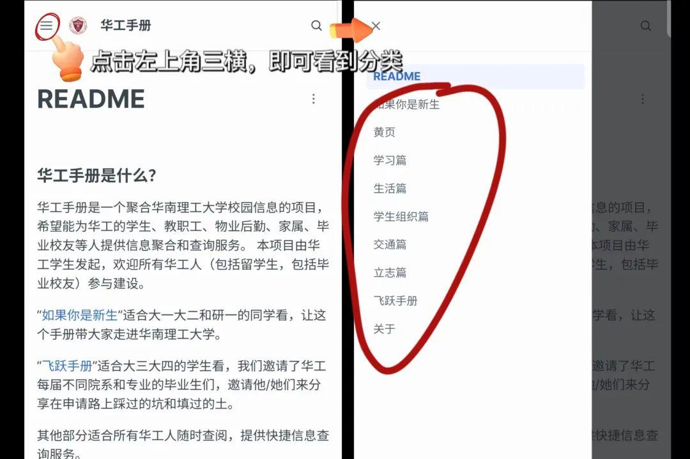
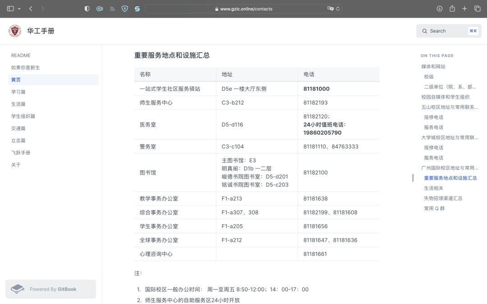
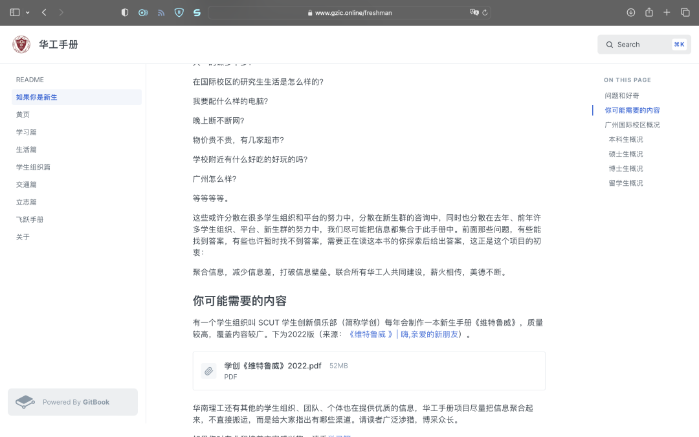
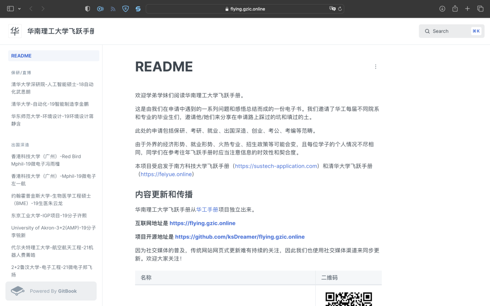
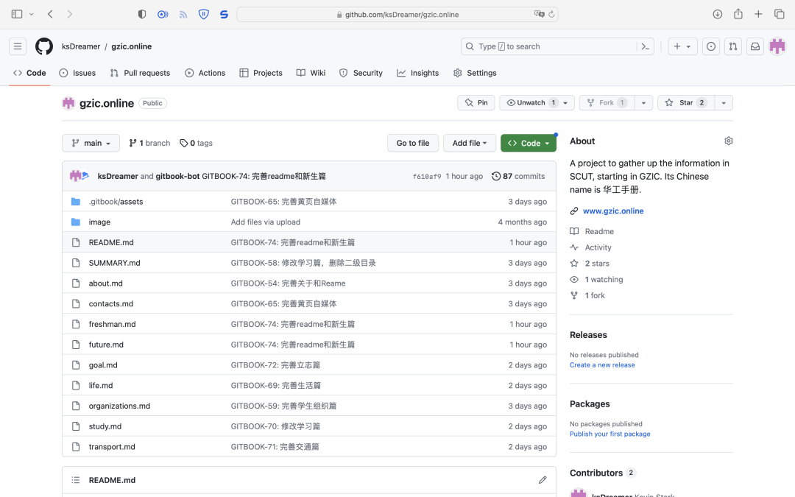

我们发起了一个开源项目：**华工手册** 。

https://www.gzic.online/ (二维码自动识别)

**可以扫码访问，其互联网地址是**  **[https://www.gzic.online](https://www.gzic.online)** 

**项目开源地址是**  **[https://github.com/MengyangGao/gzic.online](https://github.com/MengyangGao/gzic.online)** 

这是一个聚合华南理工大学校园信息的项目，希望能为华工的学生、教职工、物业后勤、家属、毕业校友等人提供信息聚合和查询服务。 这个项目由在读学生发起，并且欢迎所有华工人（包括留学生，包括毕业校友）参与建设。

## 它里面有什么？

有**信息聚合** ：给很多学生组织做了引流，方便大家找到**优质的文章攻略** 。

http://weixin.qq.com/r/RHWcmI7EhUb5Kcr7byDA (二维码自动识别)

有**信息查询** ：制作了例如地址与联系方式的黄页，方便大家**查找想要的信息** 。

有**面向新生** 的“如果你是新生”：介绍华工手册的使用攻略，带大家走进华南理工大学。

有**面向大三大四学生** 的“飞跃手册”：我们邀请了华工每届不同院系和专业的毕业生们，邀请他/她们来分享在**考研、保研、出国深造、就业等申请历程的心得体会** 。

还有很多很多。

## 为什么做华工手册？

华工一校三区每天有无数的信息产生，有很多非即时的信息（例如电话黄页、失物招领汇总），也有很多即时性信息（例如校园热点新闻、通选课指南），这些信息对学生、教职工、行政人员、后勤人员以及毕业校友等有帮助。

很多学生组织都在产出信息或者做信息流通的工作，例如学生会、各学院书院、学创、包打听、华工哩咕、小灯神、GZIC 小圈等。但是信息太多太分散了，刚入学的新生很难一次性把这些信息平台全部关注一遍，在校园里大家也不一定能准确找到自己想要的信息。而且很多不同组织在做相同的事情，白白浪费了时间和精力。

受启发于南科手册，我们打算制作一本华南理工大学的校园信息百科全书，聚合大家生活、学习、去向等各方面信息，成一个平台，谓之**华工手册。** 

互联网本应是一个开放的世界，而不是一个个组织所划定的信息孤岛。或许大家见到过不同的组织发起许多黑市群拼车群新生群，这些群功能重复却彼此孤立，我们往往需要打开好几个群聊后才能找到令人满意的信息。试想有一个平台，能够团结所有人、所有宣传力量往一处使，我们就再也不用加那么多同质性的群了，因为在那里有相同需求的人多，有交易需求的同学可以更加便捷快速地找到买卖另一家，想要拼车的同学更容易找到拼车伙伴，获取信息也不再繁琐、容易遗漏，这是多么美好的事情啊。

---

华工手册还在迭代中（希望能一代传一代，长期更新），欢迎大家一起来参与这个开源项目！目前18级、19级、20级、21级、22级的学生参与在其中做贡献，我们希望能团结更多的人。华工手册不属于哪一个人，它属于华南理工大学所有人。

因为社交媒体的普及，传统网站网页式更新难有持续的关注，因此我们也使用社交媒体渠道来同步更新。我们需要大家帮忙宣传，但不希望是那种今天朋友圈刷屏，一周后无人问津的那种，因此鼓励大家在网页端收藏华工手册，或者关注这个公众号。“GZIC小圈”诞生的初衷之一就是为了促进国际校区的信息流通，建立一年来给国际校区的学生、教职工、物业后勤等应该有提供一定的便利。

如果认可这个项目，认可促进信息流通有重要意义的话，欢迎大家参与到这个开源项目中一起来，也鼓励大家在其他社媒（例如小红书、B站、知乎、豆瓣等）帮忙宣传。一个人的力量是有限的，所有华工人团结起来的力量是无限的。

因为各种原因，这个小册子的内容或许不能面面俱到，惟盼能帮到大家。 

https://www.gzic.online/ (二维码自动识别)

**华工手册的互联网地址是**  [https://www.gzic.online](https://www.gzic.online)

**项目开源地址是**  [https://github.com/MengyangGao/gzic.online](https://github.com/MengyangGao/gzic.online)

**转发这篇文章吧！华工手册需要大家的宣传，一起建设它，一起建设华南理工！** 

本文同时发布在微信公众号“GZIC小圈”**：** [华工手册｜想团结所有华工人](https://mp.weixin.qq.com/s/tq201WeYiMCX8E3AUddjzw)
