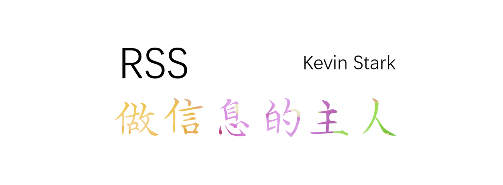
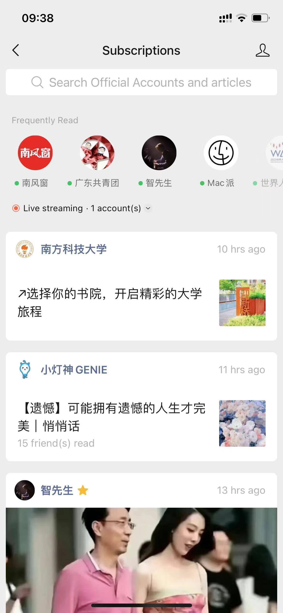
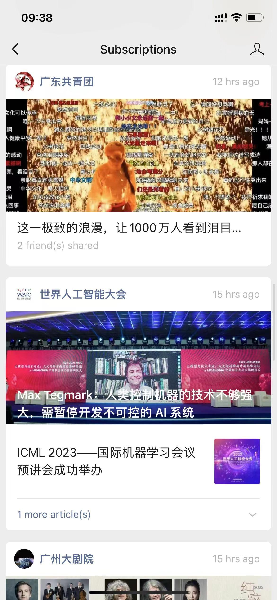
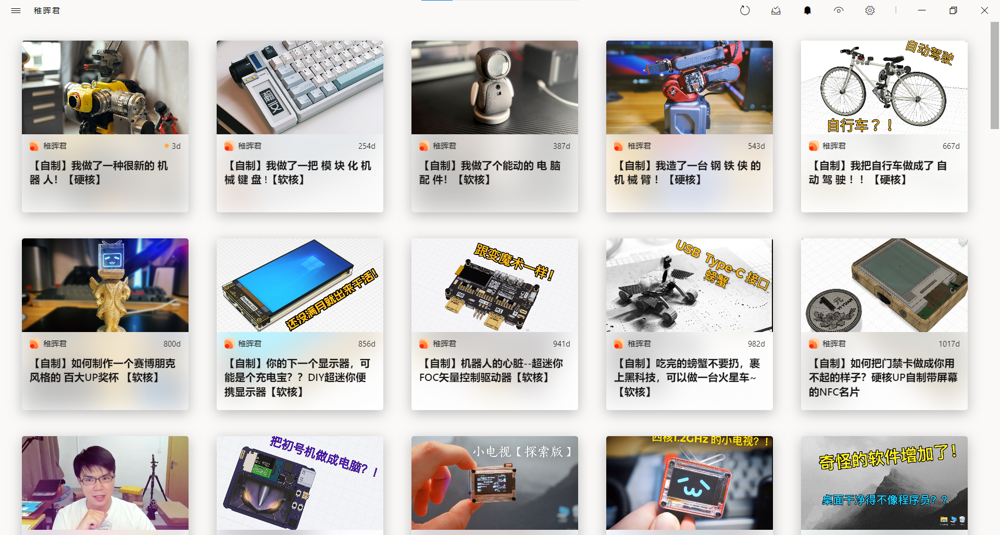
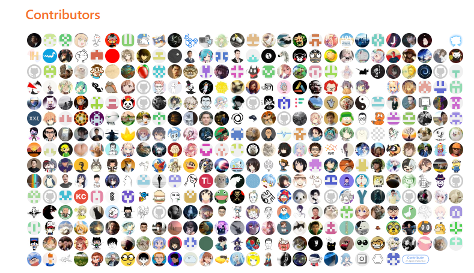

## 前言

我从大二开始在学校和社会范围内做过一些信息聚合、互助共享的尝试，深深体会到很多人的信息检索和获取能力不足。我看到这个世界有些人非但不在缩小信息差，反而刻意制造信息差，通过阻碍信息流通、制造信息茧房和营造信息焦虑等方式割韭菜。我厌恶这种不创造价值但是在制造压迫剥削和不公的行为。这个世界本可以更美好，一个开放互助共享，鼓励原创、交流和实干的社会，而不是一个充满钻营、封闭和内卷的社会。

因此写了一篇文章介绍 RSS，想分享我关于信息流通和获取的一些折腾和思考。它诞生于20年前，却深刻改变了我这半年的信息获取模式。

## 什么是 RSS？

RSS 全称是 Really Simple Syndication （中文可译为简易信息聚合），是一种信息分发模式。

你可以把 RSS 理解成整个互联网范围的公众号订阅：

几乎每个微信用户都会在微信里订阅公众号，有一些是个人自媒体、有一些是官方号……公众号很多，找到你认可的或者你需要的，然后点个关注，就可以在微信里得到推送了。

|||
|------|------|

然而这个世界很大，并不是只有微信一个平台，还有很多高质量或者你需要的信息源并不在微信里，它们各自独立或分散，好像我们没有一个全局的“关注”键，能像在微信关注公众号那样持续了解其内容变更和新的动态。

但其实有的，那个关注键就是 RSS。

## 为什么用 RSS？

正如前文所言，作为整个互联网的关注键，RSS可以用来聚合多个网站的更新内容并自动通知订阅者。它有很多的好处：

### 聚合信息获取渠道避免遗漏

你有没有遗漏信息的经历？或是不知道自己喜欢的歌手明星新动态，或是不知道学校教务处的新通知。这是因为我们不会每时每刻都去关注有无新信息，不会经常登上去某个网址或者 APP 里去查某某的信息。

而RSS 能将很多跨平台的内容生产者动态汇总起来，包括网站（公司网站、学校教务处、新闻门户等等）、B站（投稿、动态、收藏夹更新、最近投币等等）、知乎（回答、想法、动态等等）、独立博客和播客等。这样，我们就不用再点进一个又一个网站去看是否有新的内容了。省时、高效，且不易遗漏。

### 拒绝瀑布流和时间黑洞

个性化推送的瀑布流是时间黑洞。在互联网企业发现这种方法能吸引用户并提高 APP 留存使用时间后，这个东西就已经不可阻挡了。如今基本什么社交/娱乐软件都走瀑布流模式，连何同学都在吐槽“门铃 APP 里面也有视频流。“

> 你会在手机里不停滑动，并不是因为每一条你看到的内容都很有意思，而是因为你不知道下一条是不是很有意思。 
视频软件里有，那是人家老本行。购物软件里有，我大概能理解，毕竟商家可以打广告。音乐软件里也有，我也能理解吧，毕竟也算是一个娱乐功能。直到我买了一个智能门铃，我给门铃配对的时候惊奇地发现，这个门铃 App 里面也有视频流。当场就给我整懵了。难道有任何一个人会想“啊，我好无聊，打开我最喜欢的门铃 APP 看一会视频吧”。 
[【【何同学】这视频能让你戒手机】](https://www.bilibili.com/video/BV1ev411x7en)

如今信息对每个人都是过剩的。我们一不小心就会陷入 B 站、抖音、小红书、知乎等等一个个时间黑洞，那些看起来很有趣很新鲜很符合你爱好的内容永远也刷不完。

而 RSS 只订阅你选择的信息源，是有限的。拒绝刷不完的瀑布流，能尽量避免你漫无目的浏览无数合你口味但可能与你无关的信息。

信息越是过剩，它的意义也越加彰显。

### 避免陷入精准推送导致的信息茧房

在数字时代，个性化推荐算法和用户画像的泛滥导致我们在互联网企业数据库中成了一个个标签的集合：烹饪、文学、数码、舞蹈、旅游、CS、AI、电影、极限运动……手指划一下屏幕，就有无数新的内容刷新出来。每次点击这些内容，都会让算法强化这个标签的权值。人们越陷于这些算法所对应的内容推送，就越容易被点击、播放、阅读等行为强化定位成某些标签的集合。如此往复，信息茧房便生成，人们逐渐被数据算法关在一个个标签里。

We are what we eat，信息摄入也是摄入。互联网的普及让我们看到了无数的信息，感慨这是一个多么广袤的世界，却不知是否已经被哪个标签绑定，深陷在哪一个角落。

而 RSS 订阅你认可的信息来源，拒绝个性化算法的精致推送，不存在用户画像。如果有多角度辩证客观的信息源，那你的每次阅读和浏览都会是思想的延伸。

### 有效找到想要的信息

随着移动互联网时代和自媒体时代的到来，信息传播的速度越来越快，互联网上的转载、借鉴和抄袭也越来越多。你想了解一个主题，在搜索引擎和 APP 里搜，推送出来的可能是同一个内容的多次转载。

因此有一个愈发严峻的问题：一方面人们有FOMO，担心错过信息；另一方面数据膨胀让高效准确获取有价值的信息变得十分困难。

这也就是有效信息信噪比问题。

RSS 让你订阅你感兴趣和认可的信息源，它们可能不是简单的转载。如果能克制住 RSS 信息源的质量和数量，你的阅读和信息获取会是一种享受，不再是各种重复转载，不再是一搜索全是同样的文字。而是来自你认可的，有门槛的信息源内容。冗余信息减少，优质信息增加，让你有效地获取想要的信息。

（但是用 RSS 来当搜索引擎用有点不现实，因为 RSS 更适合跟进新的动态，不是很适合做以前信息的整理和分析。而且那样用需要你有足够广且质量高的信息源。）

（另外提示一下，用 RSS 订阅微信公众号、抖音博主的更新比较困难，这是因为这些互联网企业封闭起来打造私域流量，拒绝 Robots 协议爬取，拒绝把内容开放到互联网上供公开索引。例如微信文章在互联网搜索引擎上都是几乎消失的，只有与微信合作的搜狗能收录。）

## 怎么用 RSS？

RSS中有两个很重要的部分：**RSS信息源** 和**RSS阅读器** 。

以微信中一个新闻类公众号《南风窗》类比，微信公众号《南风窗》的编辑们出了一篇新推文[他们已经用ChatGPT赚了一大笔](https://mp.weixin.qq.com/s/CKJqi0U7B0IPw59hmkYedg)，订阅了这个公众号的微信用户就可以在“订阅号”消息中看到这篇推送，感兴趣的用户会点进去，在微信中阅读这篇文章。

《南风窗》就好像一个 RSS 信息源，微信就好像一个 RSS 阅读器。

### RSS 信息源

RSS 信息源是你自己选择的各种信息渠道/信息来源，而不是由各种推荐算法、视频流喂给你的东西。它的范围非常广泛：某位 B 站 up 主的投稿（动态、投币、收藏夹……）、某位知乎答主的回答（赞同动态、收藏夹、专栏……）、独立博客、新闻媒体网站等等。

例如，我订阅了稚晖君的 B 站投稿视频，效果如下。

稚晖君的 B 站投稿是信息源。同理，除了 B 站，稚晖君的微博也是信息源，知乎是信息源，博客是信息源（虽然但是好像大佬的博客挂了），他的 Github 也是信息源！我不用单独点开 B 站，知乎，微博，Github，我只需要把这些信息源都订阅了，就能在 RSS 中及时获取他所有公开平台的动态和内容了。

怎么获得 RSS 源？有两种方法，一种是用现成的 RSS 源，一种是自己搭建。

### 用现成的 RSS 源

如果不想太折腾，可以用现成的 RSS 源尝试一下。怎么用呢？看这篇文章：[可能是目前最全的 RSS 源，公众号也有！ - 奔跑中的奶酪 (runningcheese.com)](https://www.runningcheese.com/rss-subscriptions)

有一些网站会在网页的顶端、右侧或者底端有一个像广播的（橙色）标志，代表这个网站支持 RSS feed 订阅。

点击那个标志，你会进入一个新的网址。通常情况下，**新网址就是那个网站的 RSS 源。** 把地址栏复制下来，在 RSS 阅读器中添加即可。或者有些网站做得贴心一点，会在网址内容中贴出你该复制的地址。那个就是 RSS 源。

还有很多网址是不支持 RSS feed 订阅的。对于那些不支持的网址，我在这推荐两个网址：

[介绍 | RSSHub](https://docs.rsshub.app/)

[FeedX – RSS全文订阅](https://feedx.net/)

这个世界有一群人活跃在一个个开源社区，他/她们制作了很多很多的 RSS 源。从此大部分不给出 RSS feed 订阅的网站，我们也能订阅了！

谢谢这些人！

### 自建 RSS 源

用现成的 RSS 源是有弊端的，你只能订阅别人提供的 RSS 源，难免会遇到有一些小众网站、独立博客暂时并没有被收录的情况。另外因为一些网络原因，上面 RSSHub 和 Feedx 两个网站都比较难打开。

因此最终极的方案其实是自建 RSS 源。感兴趣的朋友可以看看这篇文章：[找不到满意的 RSS 服务？你可以自己搭建一个 - 少数派 (sspai.com)](https://sspai.com/post/57498)

### RSS 阅读器

找到 RSS 源之后，需要一个能承载这些的地方供你阅读，也就是 RSS 阅读器。

各个操作系统上有很多不同的 RSS 阅读器，可以分为**在线阅读器** 和**本地阅读器** 。

在线阅读器例如 [Inoreader](https://www.inoreader.com/)，[Feedly](https://feedly.com/)，[小幻阅读](https://reader.richasy.net/zh/)，[Reeder](https://reederapp.com/)，可以跨设备同步你的订阅 RSS 源和已读、未读、星标文章。

本地阅读器例如 [Fluent Reader](https://hyliu.me/fluent-reader/)，你可以通过导出整个订阅列表 OPML 文件把RSS 列表同步到另一个阅读器。

具体哪个好用我就不做推荐了，因为工具的使用最终是落于其功能是否符合每个人的需求、习惯和审美。大家可以参考网上很多介绍 RSS 阅读器的文章，我推荐一篇，但要注意时效性和片面性，还有很多很多的阅读器没有被收纳其中。文章地址在此：[国内最好的 RSS 阅读器是什么？ - 知乎 (zhihu.com)](https://www.zhihu.com/question/19648264/answer/2629554375) 

我自己的方案是：

**iOS、iPadOS 和 MacOS 上用 Reeder 5或 NetNewsWire** 

**Windows 上用 Fluent Reader** 

## 思考和分享

这半年我一直在学习，在思考。去了解 RSS，在用 RSS，也在想 RSS 为什么不再流行。

主动获取信息还是被动接受信息；遇到问题问人还是去搜索引擎和AI里搜。被一个软件生态捆绑还是拥抱整个互联网，乃至整个世界。

这是两种选择。

以下内容是我这一段时间在学习过程中的摘录，分享出来供大家阅读和思考。

>  很多人会说，RSS一定会获取到有用的信息吗？这取决于信息源的可靠程度。也就是需要你自己去选择。由于它是不含推荐算法的，就不会根据你选择的，再给你推荐一些可能是非常有用的。
再谈谈知识焦虑，每天觉得有大量知识需要吸收，不学习全就会落下风。大家都明白mark了也并不会看的，但还是mark很多，但你并不会有时间或者精力去看，也记不住辣么多。因为信息爆炸了，我们的大脑还和古人差不多，且人类记忆有其自然规律。既然不会看，那就不mark了，用到啥学啥，或许是个不错的策略。
[二零年RSS杂谈 - 知乎 (zhihu.com)](https://zhuanlan.zhihu.com/p/149452085)

### 个性化推荐和信息茧房

精准推送、用户画像、偏见、信息渠道、相同信息重复导致可信度提高

### 为什么 RSS 死了？

1. RSS 自身的反商业化性质、版权问题。

RSS 因为不是在门户网站里面，所以互联网企业不能通过 Cookie 等数据读取到用户信息和隐私。而且 RSS 协议呈现的阅读内容通常会把广告给屏蔽再外，对于互联网企业，这是阻碍它们商业利益的。也许正是因此，大型商业和互联网企业不喜欢 RSS。

> Google 放弃 RSS 已有六年，虽然仍有不少同类服务取代其继续运营，但是不难看出随着社交媒体和一些内容聚合平台逐渐成为一手的新闻发布平台，以及国内外许多媒体网站纷纷推出自己的独立客户端并且逐渐限制 RSS 内容的输出，许多人对于 RSS 是否还能持续发展现在已经无法给出一个坚定的答案。 
[一切只为给你更好的阅读体验，老牌 RSS 阅读器 Reeder 更新 4.0 - 少数派 (sspai.com)](https://sspai.com/post/54241)

2. 门槛过高、对用户不友善

3. 信息源过多导致的信息过载

> 多数人，尤其是近几年开始使用 RSS 之士，几乎都是社交网络的受害者——或至少自以为是受害者。人们抱怨社交网络，人们抱怨分享点赞，人们抱怨算法推荐，然后想当然认为相比之下“三五”的 RSS 订阅是人间正道。 但任何尝试 RSS 订阅的人，马上会遇到帕金森琐碎定律：通过使用 RSS 节省下来的时间，总会用于订阅更多的 RSS 订阅源，最终你看到的信息可能更多，往往还比原先更累。 但 RSS 本身并没有责任。客观地说，RSS 本来就不是专门为了读文章而设计的，从一开始，RSS 就只是一个通用的信息发布方式，并没有局限于文章。例如，国内外相当一部分高校都提供了 RSS 订阅，作为“校训通”平台，发布停水停电、催促缴费、课表变动等琐碎事项。再如，近几年 RSS 复兴的浪潮——或许只是余波——中，更多媒体形式也搭上了 RSS 渠道，微博、推特都有人尝试将其 RSS 化；文刀在会员栏目中，也曾介绍过一种用 RSS 订阅视频更新信息的思路……可以说，你越是认为 RSS 很重要，越是把它作为抵抗信息过载的主要武器，那么你的 RSS 订阅列表必然积重难返。 
[为什么要使用两个 RSS 阅读器：一种信息过载的特效药 - #UNTAG (utgd.net)](https://utgd.net/article/9896)

> 国外著名博客作者 Macro Arment 在一篇题为《[RSS 阅读器的力量](https://marco.org/2013/03/26/power-of-rss)》的文章中，有以下几个关于 RSS 订阅源选择的建议：
> 
> **定期整理** ：如果一个网站每天发布许多项目，而你又几乎根本不阅读它们，或者你发现自己总是会将某个数据信息全部标注为已读，那就把这个订阅数据删除。
> 
> **订阅更新频率不高的网站** ：RSS 的最佳应用方式就是跟踪大量不定时更新的网站，如那些你记不得每天去查阅的网站，因为它们只是偶尔发布消息，而且你社交网络的朋友们基本上找不到或者链接不到它们。
> 
> 定制符合自己阅读习惯的 RSS 是一个取舍的过程，不仅仅是添加，还要善于做减法，尽量精简，从而达到「去芜存菁」的效果。不然，每天看着日渐增加的未读数目，会产生负担感，阅读欲望大打折扣。在对订阅的内容进行归类的时候，建议将分类以重要度分，而不是源的种类，分清内容的轻重缓急，便于安排阅读时间和次序。
> 
>  经过一番精选之后，你每次打开 RSS 阅读器将会是享受而不是负担。
> 
>  如何阅读，相信每个人心中都有一个哈姆雷特，工具和方法千变万化，RSS 或许会为你的阅读锦上添花，但是真正的阅读，最需要的还是一颗能静下来的心。 
[如何应对资讯过载：关于 RSS 订阅的一点心得 - 少数派 (sspai.com)](https://sspai.com/post/27227)

4. 自己选择信息源导致的偏见和信息茧房

这是一个非常重要的点，不是说用了 RSS，拒绝个性化算法精致推送，就能做到独立思考没偏见和避免进入信息茧房。

因为RSS 让你只订阅自己认可的信息源，当你身边全是你感兴趣的，你认可的内容，你可能会忘记，这些内容之所以会出现，是因为你没订阅其他的内容，换言之，那些内容没有在你身旁发声出现的可能。当你身边都是一种声音，一个主题，一个观点，你大概率会以为这就是对的，这就是真理。实际上不一定哦！

可以看看下面这段摘录：

>  作为 RSS 用户的我，最普遍的体验就是看下标题，标记已读，寻找下一篇，如此循环往复，像极了敷衍批阅奏折的昏君。当然你可能会质疑说，那不过是因为我订阅源过多、注意力涣散、心浮气躁、时间紧迫诸如此类。然而问题的关键并不在于此，设想一个过于理想化的读者，可以不被自己甚至尚未察觉的喜恶/偏好左右从而始终对任何新鲜事物保持强烈至少是同等的好奇心与求知欲，无疑在逃避问题。问题的关键在于，**无论你如何精简信息源，如何利用关键词过滤，你始终无法控制信息源的内容生产本身，** 即无论这个信息源对你而言多么重要，它总是有可能生产些你其实并不感兴趣而自觉或不自觉就舍弃的内容——这既是 RSS 的优点同时也是缺点，信噪比始终存在，而相似度算法的优势至少在于更可能迅速抓住你稍纵即逝的好奇心、求知欲，至少无疑是某些难以集中注意力长时间阅读的读者的福音。不妨设想一下，假设某个 RSS 源产生的信息几乎正是你所喜好的（我认为此处区分喜好与需要，无关宏旨），**这同相似度算法提供的内容有多大的本质区别，在我看来仅仅信息来源是否单一的形式差别。** 相较而言，如果总是不经意就习惯了在 RSS 阅读器中走马观花，迅速游走，耐心与专注必然逐渐枯竭。
> 
>  那么我们究竟在何种意义上对推荐算法爱恨交加、避犹不及？一方面的确与所谓隐私、用户画像有关，另一方面我想我们真正害怕是我们自己而非算法本身——我们害怕自己成为推荐算法哺育下的那个单向度的自己，又或者说对过于亲近自己的天然恐惧。与之对照的 RSS 用户的微妙的心理活动则是，你越是加速成为自己想要成为的人，越是恐惧错失人生诸多可能性。 
[短评 Refind：英文阅读何必是RSS ？ - 少数派 (sspai.com)](https://sspai.com/post/78510)

这一段话说的很有意思。

> “像极了敷衍批阅奏折的昏君”

> “你始终无法控制信息源的内容生产本身”

> “信噪比始终存在”

> “我们真正害怕是我们自己而非算法本身”

以及最后一句话：

> “你越是加速成为自己想要成为的人，越是恐惧错失人生诸多可能性。”

那对于 RSS 导致的偏见和信息茧房，我目前想到的好方法是：交流和交换。

多与你的朋友、你的同学、你愿意分享信息的人和你希望长久保持联系的人分享你的信息源和信息渠道，多交流多交换，这样能打开自己的限制。

这个想法是去年和读书会的朋友们交流分享 RSS 这种模式时一起探讨总结出来的观点。谢谢他/她们！

5. 获取信息的质量并不会随着RSS源的增多而必定提高

>  不错的文章，这套工具流本身对于爱折腾的学生来说可以一试，但如果你时间已经比较宝贵了，看看点个赞就好。 为什么？ 因为这个工作流有一个致命的问题……阅读RSS订阅源的东西本身不一定比刷抖音“营养”多很多。 靠刷很多30秒一篇快讯，或许能获得比抖音更多的【信息】，但绝不是结构化的【知识】，如果想要提升自己，需要的至少是【知识】（而且还要结构化），更何况还没有【实践】。 
[https://sspai.com/post/75228#:~:text=不错的文章,还没有【实践】。](https://sspai.com/post/75228#:~:text=不错的文章,还没有【实践】。)

>  RSS 的用户很容易染上无节制地增加订阅源的习惯，尤其是学会使用订阅源制作工具后，走马观花式地扫几眼后，直接按下「全部已读」变成常态。我个人认为如果希望保证 RSS 阅读的体验，就要在这方面加以克制，避免自己的阅读器中充斥大量混乱的信息。 
[https://sspai.com/post/47100](https://sspai.com/post/47100)

6. 社交媒体的冲击

follow 代替 subscribe 的趋势、以个人低门槛的流媒体分享取代中心化的门户网站和博客发布。及时反馈性强的社交媒体。

还有几个问题：

是不是所有的人都适合使用 RSS 作为获取和阅读信息的方式？

是不是所有的信息都适合使用 RSS 来进行获取？

如何在这个信息爆炸的时代找到那些适合使用 RSS 阅读的资源？

> **新浪腾讯新闻上面的新闻有看的必要吗？现在的新闻网站上面的信息不靠谱，我们会不会被误导。如何利用这些新闻网站，从中获取到有用的信息。有没有什么学习方法？** 
> 
>  A：类似这种门户网站的新闻，我的建议是，除非你的工作或业余生活与之非常强相关，否则建议不需要每天浏览。
> 
> 原因很简单，在信息过载的这个时代，门户网站依然背负着点击率、浏览量这些KPI的考核，追求这些考核指标的内容自然在内容选题上会更青睐于短期收益极高的内容，具体表现形式就是标题党了，看完后你啥也没学到；
> 
> 另一个重要的点是，看一个内容源是否符合你的需求，要看它的目标受众群体定位。这些门户网站的受众群体是全中国的所有网民，像你一样已经意识到「不靠谱」的这类用户，基本上不是他们的目标受众，所以你花那么多时间去看一个压根不是为你准备的内容网站，你觉得值吗？
> 
>  如果是行业类的新闻、动态，你需要获取第一手信息，我相信会有更加垂直的行业媒体能满足你的需求，就看你如何去挖掘了。至于行业政策信息，建议直接看官方发的原文而不是这些门户网站中部分不靠谱专家的二次解读。 
[门户网站有必要看吗？ - 少数派 (sspai.com)](https://sspai.com/post/35434)

有没有一个健康良性发展的模式？能解决RSS的版权问题、对内容生产者原投稿平台的分流。

> 这个从内容生产方的角度来说，确实是一个比较矛盾的问题，目前来说RSS阅读器确实没法增加网站的点击量，我个人认为，这个问题是RSS本身协议所造成的缺陷，现在RSS的版本还是停留在2003年，但我认为RSS协议在将来一定会有个进化，从而支持现在流行的比如Google analyse等第三方统计平台的标准，从而平衡内容生产方和阅读方的利益。 
[门户网站有必要看吗？ - 少数派 (sspai.com)](https://sspai.com/post/35434)
 

### RSS 的未来

RSS 代表的意义、世界范围的信噪比问题、互联网未竟之志

>  未来的曙光或转折点在于，**社会人均接收信息量级再上一到两个层级，也就是有效信息筛选变为一个社会普遍问题后** （与经济发展形势也有关系），这意味着**用户的「平均信息获取便捷性」诉求>「平均信息质量」诉求时** ，辅以更为出色的产品设计（目前主流的阅读器的学习曲线极高），此商业模式才有想象力。 
[就现在来看（2017年初）RSS是否已经没落了？未来是否会消失？ - 知乎 (zhihu.com)](https://www.zhihu.com/question/54729057/answer/141664588)

好的 RSS 模式会更尊重知识产权和版权，能给原出处/内容生产者带来流量或者受益。

>  我眼中的下一代 RSS，它应该能给内容创建方带来很多收益（广告、点击量），同时也能给阅读者带来交互的快感（评论、点赞回溯）等等。 
[使用 RSS 可以做什么你未曾想过的事 | Matrix 线上分享会回顾 - 少数派 (sspai.com)](https://sspai.com/post/34280)

RSS 的未来在于使用价值和使用体验。要把使用门槛降低。随着应用层和交互模式的不断探索优化，对于普通用户要封装起 XML 格式、Feed/opml/rss 等后缀、服务器搭建等技术名词，就像 Apple 和拓竹分别在传统智能手机和3D 打印机领域颠覆的事情。

以及用 AI 等技术来智能收集汇总信息，每个人都有属于自己的信息摘要。到此步就不一定非得局限于 RSS 的形式了。（但是想想，你愿意把信息权交由其他人或者 AI / 机器人帮你打理吗？你得到的是你想要的吗，还是说是别人想要你得到的，还是说……）

## 结语

RSSHub 并不是一个人能做到的事，Feedx 的站长也当然可以选择制作 RSS 源后自用而不分享出来，不去看网友们的留言和 RSS 请求。每个人的兴趣和需求不一，不能指望哪一个人去回应所有人的需求。更理想的状态是给每一个人工具，让其具备自己动手丰衣足食的能力，让其有途径追寻自己想要的东西。

这也正是开源的力量。很庆幸，这个世界有一群人——这群人拥抱**开源开放、互助共享** 的理念。

我看到一个个个体参与到开源项目中，有人指了一条路后，大家具备了自己动手满足需求的能力。

我看到随着越来越多的人的参与和贡献，RSSHub 能支持的网站越来越多。

我看到星星之火，可以燎原。

还有另一段话，来自前面的 Feedx 站长。

>  如果你不小心发现了这里，又如果你是真心喜欢RSS，你的眼前是不是出现了一大片新大陆…这种感觉我有过，欢喜之情溢于言表。我觉得不止我一个人对RSS全文输出有兴趣，所以我把它放到网上共享。 
[献给那些至今还对RSS钟情的人们 – FeedX](https://feedx.net/about)

是的，是的，我眼前出现了一大片新大陆。我体会到这种感觉，欢喜之情溢于言表。

---

## 参考文章和推荐阅读

这里有三篇质量很高的介绍文章，分别对应 RSS 总体、信息源和阅读器：

[知道RSS的人越少，我就越希望它能被人知道！ - 知乎 (zhihu.com)](https://zhuanlan.zhihu.com/p/349349861)

[可能是目前最全的 RSS 源，公众号也有！ - 奔跑中的奶酪 (runningcheese.com)](https://www.runningcheese.com/rss-subscriptions)

[国内最好的 RSS 阅读器是什么？ - 知乎 (zhihu.com)](https://www.zhihu.com/question/19648264/answer/2629554375)

如果只是想知道怎么使用RSS 的话，上面这三篇配合这篇文章应该够用了。下面的链接是分享给大家阅读思考的。

[高效获取信息，你需要这份 RSS 入门指南 - 少数派 (sspai.com)](https://sspai.com/post/56391)

[关于RSS现状的思考 - 少数派 (sspai.com)](https://sspai.com/post/32992)

[使用 RSS 可以做什么你未曾想过的事 | Matrix 线上分享会回顾 - 少数派 (sspai.com)](https://sspai.com/post/34280)

[我有特别的 RSS 使用技巧 - DIYgod](https://diygod.me/ohmyrss)

[你必读的 RSS 订阅源有哪些？ - 程引的回答 - 知乎](https://www.zhihu.com/question/19580096/answer/20490041)

[数据垄断和信息孤岛，是如何驯化我们的？ (qq.com)](https://mp.weixin.qq.com/s?__biz=MzAxNTY0NjEzNg==&mid=2247485286&idx=1&sn=24eda6551c5ba58ee16699ac8221dc8e&chksm=9b81abb1acf622a7c540c42689c33c41417845fe320ebc83a0c7b4d85cd8785512916fa2456b&mpshare=1&scene=1&srcid=0124Z6NiYzk22PxvhH07GagL#rd)

[The power of the RSS reader – Marco.org](https://marco.org/2013/03/26/power-of-rss)

[论 RSS 的「复兴」 - 少数派 (sspai.com)](https://sspai.com/post/43998)

[RSS二十年 (qq.com)](https://mp.weixin.qq.com/s/VUhz2Tg08UqYSAZB6nU9MQ)

[为佩奇关闭Google Reader的魄力叫好](https://m.techweb.com.cn/article/2013-03-14/1283033.shtml)

[阅读的不将就 — RSS使用分享 | Jack‘s Space (veryjack.com)](https://veryjack.com/technique/阅读的不将就-rss使用分享/)

[算法推荐与 RSS 订阅 - gq's blog (zgq.ink)](https://zgq.ink/posts/recommendation-algorithm-vs-rss)

[重新开始使用 RSS 阅读器 | Reorx’s Forge](https://reorx.com/blog/reinitiate-rss-reader/)

[关于RSS、阅读的一些思考 - 知乎 (zhihu.com)](https://zhuanlan.zhihu.com/p/22531569)

[少数派思考 007：关于 RSS - 少数派](https://sspai.com/post/71637)

Kevin Stark 高梦扬

2023年7月22日

这篇文章献给 Aaron Swartz，RSS 1.0 作者，天才，极客，理想主义者，20岁此时此刻我的偶像。
